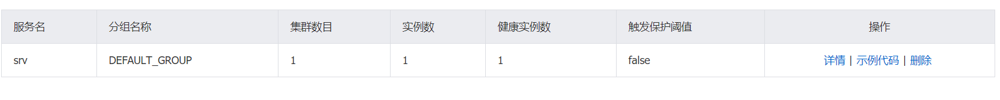

# ktor-nacos


将 ktor 框架注册到nacos注册中心。

## 如何使用

```xml

<dependency>
    <groupId>top.youngxhui</groupId>
    <artifactId>ktor-nacos</artifactId>
    <version>0.0.1</version>
</dependency>
```

### 服务端

将服务注册到 nacos 上。

对 application.conf 进行配置，填写 nacos 相关配置。

```conf
ktor {
    deployment {
        port = 8080
        port = ${?PORT}
    }
    application {
        modules = [ com.example.ApplicationKt.module ]
    }
}

nacos {
    port: 8848
    address: 127.0.0.1
}
```

将 feature 进行安装,并且进行 `serverName` 进行配置。

```kotlin
@Suppress("unused") // Referenced in application.conf
@kotlin.jvm.JvmOverloads
fun Application.module(testing: Boolean = false) {
    install(NacosDiscover) {
        serverName = "srv"
    }
}
```

启动 nacos，然后启动项目。

在 nacos 控制台可以看到新注册的服务。



### 客户端配置

客户端同样需要配置 nacos 的相关信息，在 application.conf 中进行配置。

配置完成后在 client 进行安装 `NacosClient`。通过 client 进行访问即可。

```kotlin
@Suppress("unused") // Referenced in application.conf
@kotlin.jvm.JvmOverloads
fun Application.module(testing: Boolean = false) {
    val client = HttpClient(Apache) {
        install(NacosClient)

    }

    routing {
        get("/") {
            val resp = client.get<String>("http://srv/greet")
            call.respondText(resp)
        }
    }
}
```

启动项目，访问客户端即可收到服务端信息。